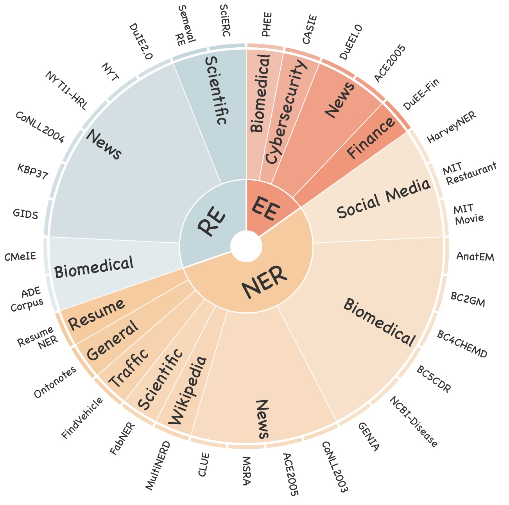
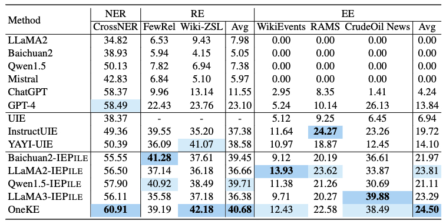
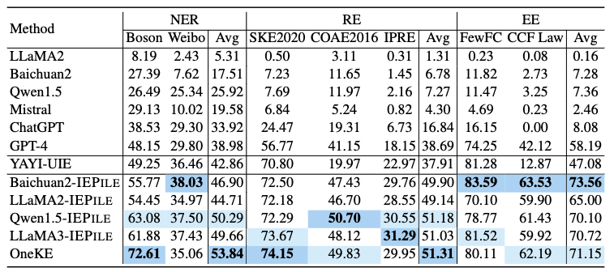
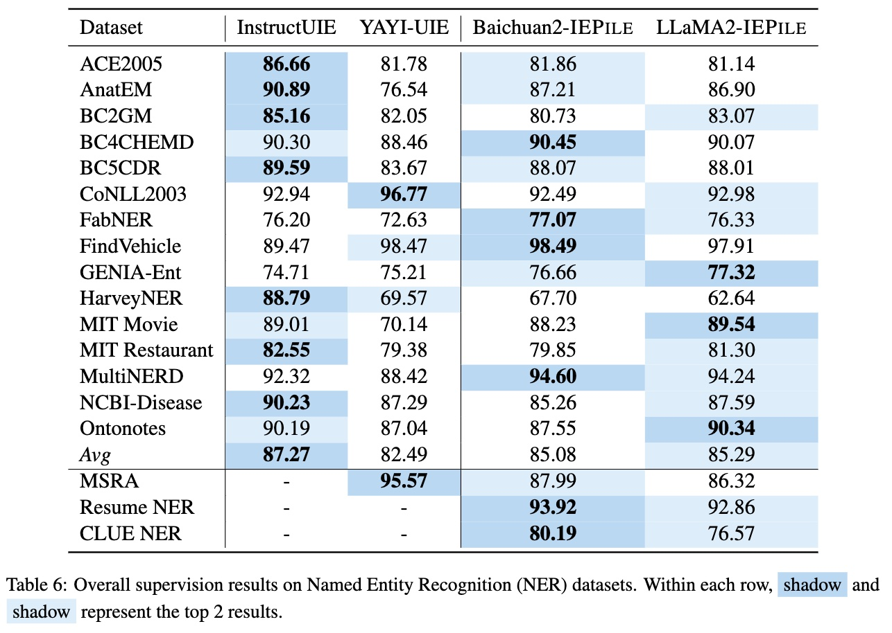
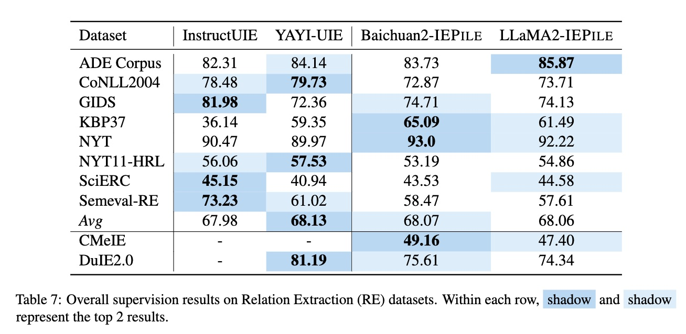
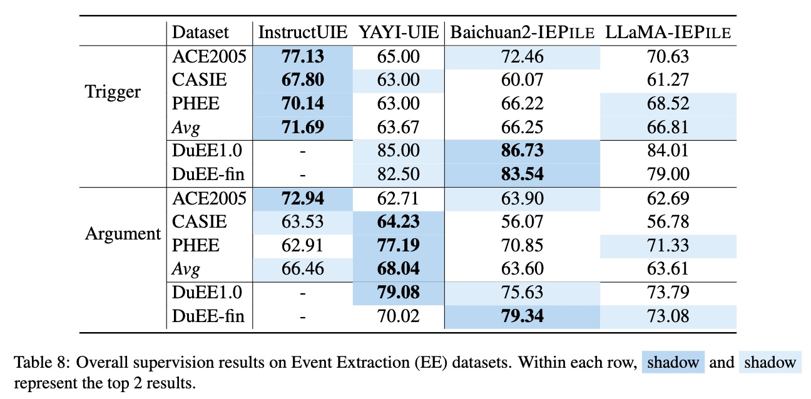
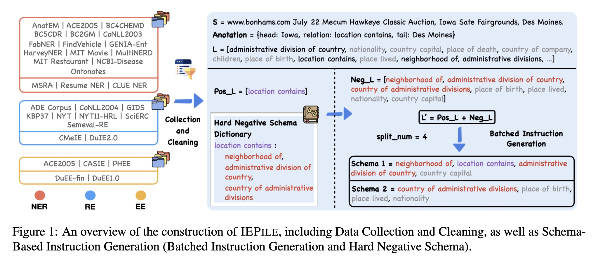

<p align="left">
    <b> English | <a href="https://github.com/zjunlp/IEPile/blob/main/README_CN.md">Chinese</a> </b>
</p>

# IEPile: A Large-Scale Information Extraction Corpus

This is the official repository for [IEPile: Unearthing Large-Scale Schema-Based Information Extraction Corpus](https://arxiv.org/abs/2402.14710)

[**Datasets**](https://huggingface.co/datasets/zjunlp/iepile) | 
[**Paper**](https://huggingface.co/papers/2402.14710) | 
[**Usage**](./README.md#3using-iepile-to-train-models) |
[**Limitations**](./README.md#8limitations) |
[**Statement & License**](./README.md#7statement-and-license) |
[**Citation**](./README.md#9cite) 

> Please note that our IEPile may undergo **updates** (we will inform you upon their release). It is recommended to utilize the most current version.


- [IEPile: A Large-Scale Information Extraction Corpus](#iepile-a-large-scale-information-extraction-corpus)
  - [News](#news)
  - [1.Introduction](#1introduction)
  - [2.Data](#2data)
    - [2.1Construction of IEPile](#21construction-of-iepile)
    - [2.2Data Format of IEPile](#22data-format-of-iepile)
  - [3.Using IEPile to Train Models](#3using-iepile-to-train-models)
    - [3.1Environment](#31environment)
    - [3.2Download Data and Models](#32download-data-and-models)
    - [3.3LoRA Fine-tuning](#33lora-fine-tuning)
  - [4.Continued Training with In-Domain Data](#4continued-training-with-in-domain-data)
    - [4.1Training Data Conversion](#41training-data-conversion)
    - [4.2Continued Training](#42continued-training)
    - [4.3Continued Training OneKE](#43continued-training-oneke)
      - [4.3.1Full SFT](#431full-sft)
      - [4.3.1Lora SFT](#431lora-sft)
  - [5.Prediction](#5prediction)
    - [5.1Test Data Conversion](#51test-data-conversion)
    - [5.2Basic Model + LoRA Prediction](#52basic-model--lora-prediction)
    - [5.3IE-Specific Model Prediction](#53ie-specific-model-prediction)
  - [6.Evaluation](#6evaluation)
  - [7.Statement and License](#7statement-and-license)
  - [8.Limitations](#8limitations)
  - [9.Cite](#9cite)
  - [10.Acknowledgements](#10acknowledgements)


## News
* [2024/04] We release a new bilingual (Chinese and English) schema-based information extraction model called [OneKE](https://huggingface.co/zjunlp/OneKE)  based on Chinese-Alpaca-2-13B.
* [2024/02] We release a large-scale (0.32B tokens) high-quality bilingual (Chinese and English) Information Extraction (IE) instruction dataset named [IEPile](https://huggingface.co/datasets/zjunlp/iepie), along with two models trained with `IEPile`, [baichuan2-13b-iepile-lora](https://huggingface.co/zjunlp/baichuan2-13b-iepile-lora) and [llama2-13b-iepile-lora](https://huggingface.co/zjunlp/llama2-13b-iepile-lora).
* [2023/10] We released a new bilingual (Chinese and English) theme-based Information Extraction (IE) instruction dataset named [InstructIE](https://huggingface.co/datasets/zjunlp/InstructIE) with [paper](https://arxiv.org/abs/2305.11527).
* [2023/08] We introduced a dedicated 13B model for Information Extraction (IE), named [knowlm-13b-ie](https://huggingface.co/zjunlp/knowlm-13b-ie/tree/main).
* [2023/05] We initiated an instruction-based Information Extraction project.


## 1.Introduction


**`IEPile`** dataset download links: [Google Drive](https://drive.google.com/file/d/1jPdvXOTTxlAmHkn5XkeaaCFXQkYJk5Ng/view?usp=sharing) | [Hugging Face](https://huggingface.co/datasets/zjunlp/iepile) | [WiseModel](https://wisemodel.cn/datasets/zjunlp/IEPile) | [ModelScpoe](https://modelscope.cn/datasets/ZJUNLP/IEPile)


> Please be aware that the data contained in the dataset links provided above has already excluded any part related to the ACE2005 dataset. Should you require access to the unfiltered, complete dataset and have successfully obtained the necessary permissions, please do not hesitate to contact us via email at guihonghao@zju.edu.cn or zhangningyu@zju.edu.cn. We will provide the complete dataset resources for your use.


Model download links for **`LLaMA2-IEPile`** | **`Baichuan2-IEPile`** | **`OneKE`**: [zjunlp/llama2-13b-iepile-lora](https://huggingface.co/zjunlp/llama2-13b-iepile-lora/tree/main) | [zjunlp/baichuan2-13b-iepile-lora](https://huggingface.co/zjunlp/baichuan2-13b-iepile-lora) | [zjunlp/OneKE](https://huggingface.co/zjunlp/OneKE)





We have collected and cleaned existing Information Extraction (IE) datasets, integrating a total of 26 **English** IE datasets and 7 **Chinese** IE datasets. As shown in the Figure, these datasets cover multiple domains including **general**, **medical**, **financial**, and others.

In this study, we adopted the proposed "`schema-based batched instruction generation strategy`" to create a large-scale, high-quality, **bilingual** (Chinese and English) IE instruction tuning dataset named **IEPile**, containing approximately `0.32B` tokens.

Based on **IEPile**, we fine-tuned the `Baichuan2-13B-Chat` and `LLaMA2-13B-Chat` models using the `Lora` technique. Experiments have demonstrated that the fine-tuned `Baichuan2-IEPile` and `LLaMA2-IEPile` models perform remarkably on fully supervised training sets and have achieved improvements in **zero-shot information extraction tasks**.







<details>
  <summary><b>Supervision Results</b></summary>







</details>


## 2.Data


### 2.1Construction of IEPile

We concentrate on instruction-based IE, thus the construction of schema within the instructions is crucial. This is because they reflect the specific extraction requirements and are dynamically variable. Previous approaches with existing IE datasets often employ a rather extensive schema processing strategy when constructing instructions, utilizing all schemas within a label set for instruction building, raising two potential issues: 
1. **Inconsistency in the number of schema queries within instruction between training and evaluation**. For example, the model's performance will decrease if it is trained on about 20 schema queries but tested with either 10 or 30, even if the training and evaluation schemas are similar in content.
2. **Inadequate differentiation among schemas in the instructions**. For example, semantically similar schemas like "layoffs", "depart" and "dismissals", may present co-occurrence ambiguities that could confuse the LLMs. Such schemas should co-occur more frequently within the instruction.

Therefore, we introduce the following solutions: 1）Hard Negative Schema; and 2） Batched Instruction Generation.





<details>
  <summary><b>Hard Negative Schema</b></summary>

Assuming that dataset $\mathcal{D}$ possesses a full label set $L$. For a given text $S$, the schemas present in its annotation constitute the positive schema set $Pos\_L$, while others form the negative schema set $Neg\_L$. In our analysis, we discover that the primary cause of model misjudgment stems from the semantic ambiguity of the schema.  In traditional approaches, the $Neg\_L$ is simply defined as $L - Pos\_L$. However, they overlook a critical aspect: it is important to pay special attention to negative schemas that are semantically close to positive schemas. Inspired by the theory of contrastive learning, we construct a hard negative schema dictionary $\mathcal{K}$, where each key represents a unique schema and the associated value is a collection of schemas that are semantically similar to the key schema. Based on this, we define the hard negative schema set as $Hard\_L = \mathcal{K}[Pos\_L]$, and the other negative schema set as $Other\_L = L - Pos\_L - Hard\_L$. The final $Neg\_L$ is constituted by $Hard\_L$ and a small subset of $Other\_L$. Through this strategy, we not only present semantically similar schemas more frequently within the instruction but also reduce the number of training instances without sacrificing model performance.

</details>


<details>
  <summary><b>Batched Instruction Generation</b></summary>

Subsequently, we obtain the final schema set $L' = Pos\_L + Neg\_L$. We employ a batched instruction generation method, limiting the number of schemas inquired in each instruction to the number of $split\_num$, which ranges between 4 to 6. Therefore, $L'$ will be divided into $|L'|/split\_num$ batches for querying, with each batch querying $split\_num$ schemas. Consequently, even if the number of schemas inquired during the evaluation phase differs from that of training, the batched mechanism allows us to distribute the inquiries across $split\_num$ schemas, thereby mitigating the decline in generalization performance.

</details>


### 2.2Data Format of IEPile

Each instance in `IEPile` contains four fields: `task`, `source`, `instruction`, and `output`. 


Below is a **data example**:

```json
{
    "task": "NER", 
    "source": "CoNLL2003", 
    "instruction": "{\"instruction\": \"You are an expert in named entity recognition. Please extract entities that match the schema definition from the input. Return an empty list if the entity type does not exist. Please respond in the format of a JSON string.\", \"schema\": [\"person\", \"organization\", \"else\", \"location\"], \"input\": \"284 Robert Allenby ( Australia ) 69 71 71 73 , Miguel Angel Martin ( Spain ) 75 70 71 68 ( Allenby won at first play-off hole )\"}", 
    "output": "{\"person\": [\"Robert Allenby\", \"Allenby\", \"Miguel Angel Martin\"], \"organization\": [], \"else\": [], \"location\": [\"Australia\", \"Spain\"]}"
}
```

The data instance belongs to the `NER` task, is part of the `CoNLL2003` dataset, the schema list to be extracted includes ["`person`", "`organization`", "`else`", "`location`"], and the text to be extracted from is "*284 Robert Allenby ( Australia ) 69 71 71 73 , Miguel Angel Martin ( Spain ) 75 70 71 68 ( Allenby won at first play-off hole )*". The output is `{"person": ["Robert Allenby", "Allenby", "Miguel Angel Martin"], "organization": [], "else": [], "location": ["Australia", "Spain"]}`.

> Note that the order of schemas in the output is consistent with the order in the instruction.


<details>
  <summary><b>More Tasks Instance</b></summary>

```json
{
  "task": "EE", 
  "source": "PHEE", 
  "instruction": "{\"instruction\": \"You are an expert in event extraction. Please extract events from the input that conform to the schema definition. Return an empty list for events that do not exist, and return NAN for arguments that do not exist. If an argument has multiple values, please return a list. Respond in the format of a JSON string.\", \"schema\": [{\"event_type\": \"potential therapeutic event\", \"trigger\": true, \"arguments\": [\"Treatment.Time_elapsed\", \"Treatment.Route\", \"Treatment.Freq\", \"Treatment\", \"Subject.Race\", \"Treatment.Disorder\", \"Effect\", \"Subject.Age\", \"Combination.Drug\", \"Treatment.Duration\", \"Subject.Population\", \"Subject.Disorder\", \"Treatment.Dosage\", \"Treatment.Drug\"]}, {\"event_type\": \"adverse event\", \"trigger\": true, \"arguments\": [\"Subject.Population\", \"Subject.Age\", \"Effect\", \"Treatment.Drug\", \"Treatment.Dosage\", \"Treatment.Freq\", \"Subject.Gender\", \"Treatment.Disorder\", \"Subject\", \"Treatment\", \"Treatment.Time_elapsed\", \"Treatment.Duration\", \"Subject.Disorder\", \"Subject.Race\", \"Combination.Drug\"]}], \"input\": \"Our findings reveal that even in patients without a history of seizures, pregabalin can cause a cortical negative myoclonus.\"}", 
  "output": "{\"potential therapeutic event\": [], \"adverse event\": [{\"trigger\": \"cause \", \"arguments\": {\"Subject.Population\": \"NAN\", \"Subject.Age\": \"NAN\", \"Effect\": \"cortical negative myoclonus\", \"Treatment.Drug\": \"pregabalin\", \"Treatment.Dosage\": \"NAN\", \"Treatment.Freq\": \"NAN\", \"Subject.Gender\": \"NAN\", \"Treatment.Disorder\": \"NAN\", \"Subject\": \"patients without a history of seizures\", \"Treatment\": \"pregabalin\", \"Treatment.Time_elapsed\": \"NAN\", \"Treatment.Duration\": \"NAN\", \"Subject.Disorder\": \"NAN\", \"Subject.Race\": \"NAN\", \"Combination.Drug\": \"NAN\"}}]}"
}

{
  "task": "RE", 
  "source": "NYT11", 
  "instruction": "{\"instruction\": \"You are an expert in relationship extraction. Please extract relationship triples that match the schema definition from the input. Return an empty list for relationships that do not exist. Please respond in the format of a JSON string.\", \"schema\": [\"neighborhood of\", \"nationality\", \"children\", \"place of death\"], \"input\": \" In the way New Jersey students know that Thomas Edison 's laboratory is in West Orange , the people of Colma know that Wyatt Earp 's ashes are buried at Hills of Eternity , a Jewish cemetery he was n't ; his wife was , and that Joe DiMaggio is at Holy Cross Cemetery , where visitors often lean bats against his gravestone . \"}", 
  "output": "{\"neighborhood of\": [], \"nationality\": [], \"children\": [], \"place of death\": [{\"subject\": \"Thomas Edison\", \"object\": \"West Orange\"}]}"
}
```

</details>


Below are the explanations for each field:

| Field | Description |
| :---: | :---: |
| task | The task to which the instance belongs, one of the five types (`NER`, `RE`, `EE`, `EET`, `EEA`). |
| source | The dataset to which the instance belongs. |
| instruction | The instruction for inputting into the model, processed into a JSON string via json.dumps, including three parts: `"instruction"`, `"schema"`, and `"input"`. |
| output | The output in the format of a dictionary's JSON string, where the key is the schema, and the value is the extracted content. |


In `IEPile`, the **instruction** format of `IEPile` adopts a JSON-like string structure, which is essentially a dictionary-type string composed of the following three main components:
(1) **`'instruction'`**: Task description, which outlines the task to be performed by the instruction (one of `NER`, `RE`, `EE`, `EET`, `EEA`).
(2) **`'schema'`**: A list of schemas to be extracted (`entity types`, `relation types`, `event types`).
(3) **`'input'`**: The text from which information is to be extracted.

The file [instruction.py](./ie2instruction/convert/utils/instruction.py) provides instructions for various tasks.


## 3.Using IEPile to Train Models

### 3.1Environment

Before you begin, make sure to create an appropriate **virtual environment** following the instructions below:

```bash
conda create -n IEPile python=3.9   # Create a virtual environment
conda activate IEPile               # Activate the environment
pip install -r requirements.txt     # Install dependencies
```


### 3.2Download Data and Models

**`IEPile`** dataset download links: [Google Drive](https://drive.google.com/file/d/1jPdvXOTTxlAmHkn5XkeaaCFXQkYJk5Ng/view?usp=sharing) | [Hugging Face](https://huggingface.co/datasets/zjunlp/IEPile)


```python
IEPile
├── train.json    # Training set
└── dev.json      # Validation set
```

Here are some of the models supported by the code in this repository:
[[llama](https://huggingface.co/meta-llama), [alpaca](https://github.com/tloen/alpaca-lora), [vicuna](https://huggingface.co/lmsys), [zhixi](https://github.com/zjunlp/KnowLM), [falcon](https://huggingface.co/tiiuae), [baichuan](https://huggingface.co/baichuan-inc), [chatglm](https://huggingface.co/THUDM), [qwen](https://huggingface.co/Qwen), [moss](https://huggingface.co/fnlp), [openba](https://huggingface.co/OpenBA)]


```bash
mkdir data         # Put data here
mkdir models       # Put base models here
mkdir results      # Put prediction results here
mkdir lora         # Put LoRA fine-tuning results here
```

Data should be placed in the `./data` directory.


### 3.3LoRA Fine-tuning

> Important Note: All the commands below should be executed within the `IEPile` directory. For example, if you want to run the fine-tuning script, you should use the following command: `bash ft_scripts/fine_llama.bash`. Please ensure your current working directory is correct.
> Please make sure that each entry in the training/validation files includes the `instruction`, `output` fields.


```bash
output_dir='lora/llama2-13b-chat-v1'
mkdir -p ${output_dir}
CUDA_VISIBLE_DEVICES="0,1,2,3" torchrun --nproc_per_node=4 --master_port=1287 src/test_finetune.py \
    --do_train --do_eval \
    --overwrite_output_dir \
    --model_name_or_path 'models/llama2-13b-chat' \
    --stage 'sft' \
    --model_name 'llama' \
    --template 'llama2' \
    --train_file 'data/train.json' \
    --valid_file 'data/dev.json' \
    --output_dir=${output_dir} \
    --per_device_train_batch_size 2 \
    --per_device_eval_batch_size 2 \
    --gradient_accumulation_steps 4 \
    --preprocessing_num_workers 16 \
    --num_train_epochs 10 \
    --learning_rate 5e-5 \
    --max_grad_norm 0.5 \
    --optim "adamw_torch" \
    --max_source_length 400 \
    --cutoff_len 700 \
    --max_target_length 300 \
    --evaluation_strategy "epoch" \
    --save_strategy "epoch" \
    --save_total_limit 10 \
    --lora_r 16 \
    --lora_alpha 32 \
    --lora_dropout 0.05 \
    --bf16 
```
* `CUDA_VISIBLE_DEVICES="0,1,2,3"`: used to specify which GPUs are available for the current training task. In this case, "0,1,2,3" means that the four GPUs with IDs 0, 1, 2, and 3 are being utilized. If your machine is equipped with more than four GPUs, this setting allows you to select any four of them for use.
* `--nproc_per_node=4`: specifies the number of processes to be launched on each node. Since four GPUs have been specified in this example, it is necessary to start four separate processes, with each process corresponding to one GPU.
* For training tasks that use only **a single GPU**, the command `CUDA_VISIBLE_DEVICES=0 python src/finetune.py` can be used to initiate the training. Here, CUDA_VISIBLE_DEVICES=0 designates GPU number 0 for this training task.
* `model_name`: Specifies the **name of the model architecture** you want to use (7B, 13B, Base, Chat belong to the same model architecture). Currently supported models include: ["`llama`", "`alpaca`", "`vicuna`", "`zhixi`", "`falcon`", "`baichuan`", "`chatglm`", "`qwen`", "`moss`", "`openba`"]. **Please note**, this parameter should be distinguished from `--model_name_or_path`.
* `model_name_or_path`: Model path, please download the corresponding model from [HuggingFace](https://huggingface.co/models).
* `template`: The **name of the template** used, including: `alpaca`, `baichuan`, `baichuan2`, `chatglm3`, etc. Refer to [src/datamodule/template.py](./src/datamodule/template.py) to see all supported template names. The default is the `alpaca` template. **For `Chat` versions of models, it is recommended to use the matching template, while `Base` version models can default to using `alpaca`**.
* `train_file`, `valid_file (optional)`: The **file paths** for the training set and the validation set, respectively. Note: Only **JSON format** files are currently supported. ⚠️If `valid_file` is not specified, a subset of `val_set_size` entries will be automatically allocated from `train_file` to serve as the validation set.
* `output_dir`: The **path to save the weight parameters** after LoRA fine-tuning.
* `val_set_size`: The number of samples in the **validation set**, default is 1000.
* `per_device_train_batch_size`, `per_device_eval_batch_size`: The `batch_size` on each GPU device, adjust according to the size of the memory. For RTX3090, it is recommended to set between 2 and 4.
* `max_source_length`, `max_target_length`, `cutoff_len`: The maximum input and output lengths, and the cutoff length, which can simply be considered as the maximum input length + maximum output length. Set appropriate values according to specific needs and memory size.
* If running out of GPU memory occurs when saving the model after the evaluation phase, please set `evaluation_strategy` to `no`.

> Quantization can be performed by setting bits to 4; it is recommended for the RTX3090.

To learn more about parameter configuration, please refer to the [src/utils/args](./src/args). 

The specific script for fine-tuning the `LLaMA2-13B-Chat` model can be found in [ft_scripts/fine_llama.bash](./ft_scripts/fine_llama.bash).


The specific script for fine-tuning the `Baichuan2-13B-Chat` model can be found in [ft_scripts/fine_baichuan.bash](./ft_scripts/fine_baichuan.bash).bash.


## 4.Continued Training with In-Domain Data

Although the `Baichuan2-IEPile` and `LLaMA2-IEPile` models have undergone extensive instruction fine-tuning on multiple general datasets and thus possess a degree of **general information extraction capability**, they may still exhibit certain limitations when processing data in **specific domains** (such as `law`, `education`, `science`, `telecommunications`). To address this challenge, it is recommended to conduct **secondary training** of these models on datasets specific to these domains. This will help the models better adapt to the semantic and structural characteristics of the specific domains, enhancing their **information extraction capability within those domains**.


### 4.1Training Data Conversion

Firstly, it's necessary to **format the data** to include `instruction` and `output` fields. For this purpose, we provide a script [convert_func.py](./ie2instruction/convert_func.py), which can batch convert data into a format that can be directly used by the model.


> Before using the [convert_func.py](./ie2instruction/convert_func.py) script, please make sure to refer to the [data](./data) directory. This directory provides detailed instructions on the data format required for each task. Refer to `sample.json` to understand the format of the data before conversion, `schema.json` to see the organization of the schema, and `train.json` to describe the data format after conversion.

> Additionally, you can directly use the bilingual (Chinese and English) information extraction dataset [zjunlp/InstructIE](https://huggingface.co/datasets/zjunlp/InstructIE), which includes 12 themes such as characters, vehicles, works of art, natural science, man-made objects, astronomical objects, etc.


```bash
python ie2instruction/convert_func.py \
    --src_path data/NER/sample.json \
    --tgt_path data/NER/train.json \
    --schema_path data/NER/schema.json \
    --language zh \
    --task NER \
    --split_num 6 \       
    --random_sort \
    --split train
```


* `language`: Supports two languages, `zh` (Chinese) and `en` (English), with different instruction templates used for each language.
* `task`: Currently supports five types of tasks: ['`RE`', '`NER`', '`EE`', '`EET`', '`EEA`'].
* `split_num`: Defines the maximum number of schemas that can be included in a single instruction. The default value is 4, and setting it to -1 means no splitting is done. The recommended number of task splits varies by task: **6 for NER, and 4 for RE, EE, EET, EEA**.
* `random_sort`: Whether to randomize the order of schemas in the instructions. The default is False, which means schemas are sorted alphabetically.
* `split`: Specifies the type of dataset, with options `train` or `test`.

The converted training data will contain four fields: `task`, `source`, `instruction`, `output`.


**`Generation of Hard Negative Samples`**: Promote co-occurrence of semantically close and easily confused schemas, reducing the amount of training samples.

```bash
python ie2instruction/convert_func.py \
    --src_path data/SPO/sample.json \
    --tgt_path data/SPO/train.json \
    --schema_path data/SPO/schema.json \
    --cluster_mode \
    --hard_negative_path data/hard_negative/SPO_DuIE2.0.json \
    --language zh \
    --task SPO \
    --split_num 4 \
    --random_sort \
    --split train
```

The addition of the `--cluster_mode` and `--hard_negative_path data/hard_negative/SPO_DuIE2.0.json` parameters, where `--hard_negative_path` corresponds to the dictionary of difficult negative samples. The [hard_dict.json](./data/hard_negative/hard_dict.json) contains dictionaries of hard negative samples for all datasets involved in IEPILE.


### 4.2Continued Training


Model download links for **`LLaMA2-IEPile`** | **`Baichuan2-IEPile`** | **`OneKE(based on chinese-alpaca2)`**: [zjunlp/llama2-13b-IEPile-lora](https://huggingface.co/zjunlp/llama2-13b-IEPile-lora/tree/main) | [zjunlp/baichuan2-13b-IEPile-lora](https://huggingface.co/zjunlp/baichuan2-13b-IEPile-lora) | [zjunlp/OneKE](https://huggingface.co/zjunlp/OneKE)

| checkpoint_dir | model_name_or_path | moadel_name | fp16/bf16 | template | 
| --- | --- | --- | --- | --- |
| llama2-13b-iepile-lora | LLaMA2-13B-Chat | llama | bf16 | llama2 |
| baichuan2-13b-iepile-lora | BaiChuan2-13B-Chat | baichuan | bf16 | baichuan2 |
| OneKE | OneKE | llama | bf16 | llama2_zh |


```bash
output_dir='lora/llama2-13b-chat-v1-continue'
mkdir -p ${output_dir}
CUDA_VISIBLE_DEVICES="0,1,2,3" torchrun --nproc_per_node=4 --master_port=1287 src/test_finetune.py \
    --do_train --do_eval \
    --overwrite_output_dir \
    --model_name_or_path 'models/llama2-13B-Chat' \
    --checkpoint_dir 'zjunlp/llama2-13b-iepile-lora' \
    --stage 'sft' \
    --model_name 'llama' \
    --template 'llama2' \
    --train_file 'data/train.json' \
    --valid_file 'data/dev.json' \
    --output_dir=${output_dir} \
    --per_device_train_batch_size 2 \
    --per_device_eval_batch_size 2 \
    --gradient_accumulation_steps 4 \
    --preprocessing_num_workers 16 \
    --num_train_epochs 10 \
    --learning_rate 5e-5 \
    --max_grad_norm 0.5 \
    --optim "adamw_torch" \
    --max_source_length 400 \
    --cutoff_len 700 \
    --max_target_length 300 \
    --evaluation_strategy "epoch" \
    --save_strategy "epoch" \
    --save_total_limit 10 \
    --lora_r 64 \
    --lora_alpha 64 \
    --lora_dropout 0.05 \
    --bf16 
```

* Please refer to the [3.3LoRA Fine-tuning](./README.md#33lora-fine-tuning) for further parameter description.
* To continue training based on the fine-tuned LoRA weights, simply point the `--checkpoint_dir` parameter to the path of the LoRA weights, for example by setting it to `'zjunlp/llama2-13b-iepile-lora'`.

> Quantization can be performed by setting bits to 4; it is recommended for the RTX3090.


> Please note that when using **`LLaMA2-IEPile`** or **`Baichuan2-IEPile`**, keep both lora_r and lora_alpha at 64. We do not provide recommended settings for these parameters.


* To continue training based on the fine-tuned model weights, just set the `--model_name_or_path` parameter to the path of the weights, such as `'zjunlp/KnowLM-IE-v2'`, without setting `--checkpoint_dir`.


The script can be found at [ft_scripts/fine_continue.bash](./ft_scripts/fine_continue.bash).


### 4.3Continued Training OneKE


#### 4.3.1Full SFT

```bash
output_dir='lora/OneKE-continue'
mkdir -p ${output_dir}
CUDA_VISIBLE_DEVICES="0,1,2,3" torchrun --nproc_per_node=4 --master_port=1287 src/test_finetune.py \
    --do_train --do_eval \
    --overwrite_output_dir \
    --model_name_or_path 'models/OneKE' \
    --stage 'sft' \
    --model_name 'llama' \
    --template 'llama2_zh' \
    --train_file 'data/train.json' \
    --valid_file 'data/dev.json' \
    --output_dir=${output_dir} \
    --per_device_train_batch_size 2 \
    --per_device_eval_batch_size 2 \
    --gradient_accumulation_steps 4 \
    --preprocessing_num_workers 16 \
    --num_train_epochs 10 \
    --learning_rate 5e-5 \
    --max_grad_norm 0.5 \
    --optim "adamw_torch" \
    --max_source_length 400 \
    --cutoff_len 700 \
    --max_target_length 300 \
    --evaluation_strategy "epoch" \
    --save_strategy "epoch" \
    --save_total_limit 10 \
    --bf16 
```


#### 4.3.1Lora SFT

```bash
output_dir='lora/OneKE-continue-lora'
mkdir -p ${output_dir}
CUDA_VISIBLE_DEVICES="0,1,2,3" torchrun --nproc_per_node=4 --master_port=1287 src/test_finetune.py \
    --do_train --do_eval \
    --overwrite_output_dir \
    --model_name_or_path 'models/OneKE' \
    --stage 'sft' \
    --model_name 'llama' \
    --template 'llama2_zh' \
    --train_file 'data/train.json' \
    --valid_file 'data/dev.json' \
    --output_dir=${output_dir} \
    --per_device_train_batch_size 2 \
    --per_device_eval_batch_size 2 \
    --gradient_accumulation_steps 4 \
    --preprocessing_num_workers 16 \
    --num_train_epochs 10 \
    --learning_rate 5e-5 \
    --max_grad_norm 0.5 \
    --optim "adamw_torch" \
    --max_source_length 400 \
    --cutoff_len 700 \
    --max_target_length 300 \
    --evaluation_strategy "epoch" \
    --save_strategy "epoch" \
    --save_total_limit 10 \
    --lora_r 64 \
    --lora_alpha 64 \
    --lora_dropout 0.05 \
    --bf16 
```


## 5.Prediction

### 5.1Test Data Conversion

Before preparing the test data conversion, please visit the [data](./data) directory to understand the data structure required for each task: 1) For the input data format, see `sample.json`. 2) For the schema format, please refer to `schema.json`. 3) For the format of the transformed data, refer to `train.json`. **Unlike training data, test data input does not need to include annotation fields (`entity`, `relation`, `event`)**.


```bash
python ie2instruction/convert_func.py \
    --src_path data/NER/sample.json \
    --tgt_path data/NER/test.json \
    --schema_path data/NER/schema.json \
    --language zh \
    --task NER \
    --split_num 6 \
    --split test
```

When setting `split` to **test**, select the appropriate number of schemas according to the task type: **6 is recommended for NER, while 4 is recommended for RE, EE, EET, EEA**. The transformed test data will contain five fields: `id`, `task`, `source`, `instruction`, `label`.

The `label` field will be used for subsequent evaluation. If the input data lacks the annotation fields (`entity`, `relation`, `event`), the transformed test data will not contain the `label` field, which is suitable for scenarios where no original annotated data is available.


### 5.2Basic Model + LoRA Prediction

Model download links for **`LLaMA2-IEPile`** | **`Baichuan2-IEPile`** : [zjunlp/llama2-13b-iepile-lora](https://huggingface.co/zjunlp/llama2-13b-iepile-lora/tree/main) | [zjunlp/baichuan2-13b-iepile-lora](https://huggingface.co/zjunlp/baichuan2-13b-iepile-lora) 


| checkpoint_dir | model_name_or_path | moadel_name | fp16/bf16 | template | 
| --- | --- | --- | --- | --- |
| llama2-13b-iepile-lora | LLaMA2-13B-Chat | llama | bf16 | llama2 |
| baichuan2-13b-iepile-lora | BaiChuan2-13B-Chat | baichuan | bf16 | baichuan2 |

⚠️ When performing the **Basic Model + LoRA Prediction**, it's necessary not only to download the Lora weight parameters but also the base model parameters. For example, when using `baichuan2-13b-iepile-lora` (specified with `--checkpoint_dir`), you must also download `BaiChuan2-13B-Chat` (specified with `--model_name_or_path`). 🚫**You cannot** merely set `--model_name_or_path lora/baichuan2-13b-iepile-lora`.


```bash
CUDA_VISIBLE_DEVICES=0 python src/inference.py \
    --stage sft \
    --model_name_or_path 'models/llama2-13B-Chat' \
    --checkpoint_dir 'lora/llama2-13b-IEPile-lora' \
    --model_name 'llama' \
    --template 'llama2' \
    --do_predict \
    --input_file 'data/NER/test.json' \
    --output_file 'results/llama2-13b-IEPile-lora_output.json' \
    --finetuning_type lora \
    --output_dir 'lora/test' \
    --predict_with_generate \
    --cutoff_len 512 \
    --bf16 \
    --max_new_tokens 300 \
    --bits 4
```

* During inference, `model_name`, `template`, and `bf16` must be the same as the settings used during training.
* `model_name_or_path`: Specify the path to the base model being used, which must match the corresponding LoRA model.
* `checkpoint_dir`: The path to the LoRA weight files.
* `output_dir`: This parameter does not take effect during inference and any path can be specified.
* `input_file`, `output_file`: Specify the input path for the test file and the output path for the prediction results, respectively.
* `cutoff_len`, `max_new_tokens`: Set the maximum input length and the number of new tokens to be generated, adjusting according to device performance.

> Quantization can be performed by setting bits to 4; it is recommended for the RTX3090.


### 5.3IE-Specific Model Prediction

| checkpoint_dir | model_name_or_path | moadel_name | fp16/bf16 | template | 
| --- | --- | --- | --- | --- |
| OneKE | OneKE | llama | bf16 | llama2_zh |


Model download links for **`OneKE(based on chinese-alpaca2)`**: [zjunlp/OneKE](https://huggingface.co/zjunlp/OneKE)


```bash
CUDA_VISIBLE_DEVICES=0 python src/inference.py \
    --stage sft \
    --model_name_or_path 'models/OneKE' \
    --model_name 'llama' \
    --template 'llama2_zh' \
    --do_predict \
    --input_file 'data/NER/test.json' \
    --output_file 'results/OneKE_output.json' \
    --output_dir 'lora/test' \
    --predict_with_generate \
    --cutoff_len 512 \
    --bf16 \
    --max_new_tokens 300 \
    --bits 4
```

`model_name_or_path`: The path to the weights of the model specialized for Information Extraction (IE).


## 6.Evaluation

We provide scripts for evaluating the F1 scores for various tasks.

```bash
python ie2instruction/eval_func.py \
  --path1 data/NER/processed.json \
  --task NER 
```

* `task`: Currently supports five types of tasks: ['`RE`', '`NER`', '`EE`', '`EET`', '`EEA`'].
* You can set `sort_by` to `source` to calculate the F1 scores on each dataset separately.


## 7.Statement and License
We believe that annotated data contains the wisdom of humanity, and its existence is to promote the benefit of all humankind and help enhance our quality of life. We strongly urge all users not to use our corpus for any actions that may harm national or public security or violate legal regulations.
We have done our best to ensure the quality and legality of the data provided. However, we also recognize that despite our efforts, there may still be some unforeseen issues, such as concerns about data protection and risks and problems caused by data misuse. We will not be responsible for these potential problems.
For original data that is subject to usage permissions stricter than the [CC BY-NC-SA 4.0](https://creativecommons.org/licenses/by-nc-sa/4.0/deed.en) agreement, IEPile will adhere to those stricter terms. In all other cases, our operations will be based on the [CC BY-NC-SA 4.0](https://creativecommons.org/licenses/by-nc-sa/4.0/deed.en) license agreement.


## 8.Limitations

From the data perspective, our study primarily focuses on schema-based IE, which limits our ability to generalize to human instructions that do not follow our specific format requirements. 
Additionally, we do not explore the field of Open Information Extraction (Open IE); however, if we remove schema constraints, our dataset would be suitable for Open IE scenarios.
Besides, IEPile is confined to data in English and Chinese, and in the future, we hope to include data in more languages.

From the model perspective, due to computational resource limitations, our research only assessed two models: Baichuan and LLaMA, along with some baseline models. Our dataset can be applied to any other large language models (LLMs), such as Qwen, ChatGLM, Gemma.


## 9.Cite
If you use the IEPile or the code, please cite the paper:

```bibtex
@article{DBLP:journals/corr/abs-2402-14710,
  author       = {Honghao Gui and
                  Lin Yuan and
                  Hongbin Ye and
                  Ningyu Zhang and
                  Mengshu Sun and
                  Lei Liang and
                  Huajun Chen},
  title        = {IEPile: Unearthing Large-Scale Schema-Based Information Extraction
                  Corpus},
  journal      = {CoRR},
  volume       = {abs/2402.14710},
  year         = {2024},
  url          = {https://doi.org/10.48550/arXiv.2402.14710},
  doi          = {10.48550/ARXIV.2402.14710},
  eprinttype    = {arXiv},
  eprint       = {2402.14710},
  timestamp    = {Tue, 09 Apr 2024 07:32:43 +0200},
  biburl       = {https://dblp.org/rec/journals/corr/abs-2402-14710.bib},
  bibsource    = {dblp computer science bibliography, https://dblp.org}
}
```

## 10.Acknowledgements
We are very grateful for the inspiration provided by the [MathPile](mathpile) and [KnowledgePile](https://huggingface.co/datasets/Query-of-CC/Knowledge_Pile) projects. Special thanks are due to the builders and maintainers of the following datasets: [AnatEM](https://doi.org/10.1093/BIOINFORMATICS/BTT580)、[BC2GM](https://link.springer.com/chapter/10.1007/978-3-030-68763-2_48)、[BC4CHEMD](https://link.springer.com/chapter/10.1007/978-3-030-68763-2_48)、[NCBI-Disease](https://linkinghub.elsevier.com/retrieve/pii/S1532046413001974)、[BC5CDR](https://openreview.net/pdf?id=9EAQVEINuum)、[HarveyNER](https://aclanthology.org/2022.naacl-main.243/)、[CoNLL2003](https://aclanthology.org/W03-0419/)、[GENIA](https://pubmed.ncbi.nlm.nih.gov/12855455/)、[ACE2005](https://catalog.ldc.upenn.edu/LDC2006T06)、[MIT Restaurant](https://ieeexplore.ieee.org/document/6639301)、[MIT Movie](https://ieeexplore.ieee.org/document/6639301)、[FabNER](https://link.springer.com/article/10.1007/s10845-021-01807-x)、[MultiNERD](https://aclanthology.org/2022.findings-naacl.60/)、[Ontonotes](https://aclanthology.org/N09-4006/)、[FindVehicle](https://arxiv.org/abs/2304.10893)、[CrossNER](https://ojs.aaai.org/index.php/AAAI/article/view/17587)、[MSRA NER](https://aclanthology.org/W06-0115/)、[Resume NER](https://aclanthology.org/P18-1144/)、[CLUE NER](https://arxiv.org/abs/2001.04351)、[Weibo NER](https://aclanthology.org/D15-1064/)、[Boson](https://github.com/InsaneLife/ChineseNLPCorpus/tree/master/NER/boson)、[ADE Corpus](https://jbiomedsem.biomedcentral.com/articles/10.1186/2041-1480-3-15)、[GIDS](https://arxiv.org/abs/1804.06987)、[CoNLL2004](https://aclanthology.org/W04-2412/)、[SciERC](https://aclanthology.org/D18-1360/)、[Semeval-RE](https://aclanthology.org/S10-1006/)、[NYT11-HRL](https://ojs.aaai.org/index.php/AAAI/article/view/4688)、[KBP37](https://arxiv.org/abs/1508.01006)、[NYT](https://link.springer.com/chapter/10.1007/978-3-642-15939-8_10)、[Wiki-ZSL](https://aclanthology.org/2021.naacl-main.272/)、[FewRel](https://aclanthology.org/D18-1514/)、[CMeIE](https://link.springer.com/chapter/10.1007/978-3-030-60450-9_22)、[DuIE](https://link.springer.com/chapter/10.1007/978-3-030-32236-6_72)、[COAE2016](https://github.com/Sewens/COAE2016)、[IPRE](https://arxiv.org/abs/1907.12801)、[SKE2020](https://aistudio.baidu.com/datasetdetail/177191)、[CASIE](https://ojs.aaai.org/index.php/AAAI/article/view/6401)、[PHEE](https://aclanthology.org/2022.emnlp-main.376/)、[CrudeOilNews](https://aclanthology.org/2022.lrec-1.49/)、[RAMS](https://aclanthology.org/2020.acl-main.718/)、[WikiEvents](https://aclanthology.org/2021.naacl-main.69/)、[DuEE](https://link.springer.com/chapter/10.1007/978-3-030-60457-8_44)、[DuEE-Fin](https://link.springer.com/chapter/10.1007/978-3-031-17120-8_14)、[FewFC](https://ojs.aaai.org/index.php/AAAI/article/view/17720)、[CCF law](https://aistudio.baidu.com/projectdetail/4201483), and more. These datasets have significantly contributed to the advancement of this research. We are also grateful for the valuable contributions in the field of information extraction made by [InstructUIE](http://arxiv.org/abs/2304.08085) and [YAYI-UIE](http://arxiv.org/abs/2312.15548), both in terms of data and model innovation. Our research results have benefitted from their creativity and hard work as well. Additionally, our heartfelt thanks go to [hiyouga/LLaMA-Factory](https://github.com/hiyouga/LLaMA-Factory); our fine-tuning code implementation owes much to their work. The assistance provided by these academic resources has been instrumental in the completion of our research, and for this, we are deeply appreciative.


